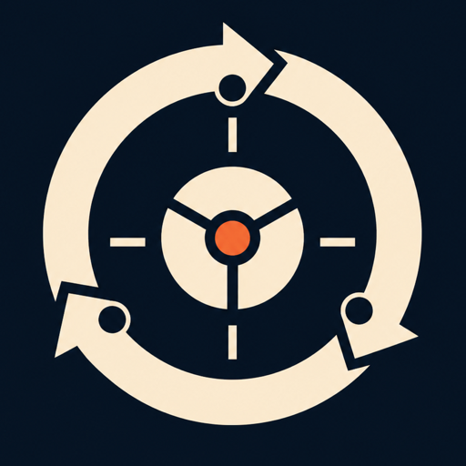

<p align="center">
  
</p>

<h1 align="center">Agentic Design System</h1>

<p align="center"><strong>A design practice for coding agents.</strong></p>

<p align="center">
  <a href="https://agentic-design-system-lovat.vercel.app">Live workshop</a>
  | <a href="./docs/INSTALL.md">Install ADS</a>
  | <a href="./PHILOSOPHY.md">How it works</a>
  | <a href="./docs/README.md">Documentation</a>
</p>

<p align="center">
  <a href="https://agentic-design-system-lovat.vercel.app">
    
  </a>
</p>

Coding agents can make a screen quickly. Agentic Design System helps them understand the product, choose an appropriate approach, inspect the rendered result, and revise before calling the work done.

ADS is a repo-local skill pack. Your agent does the work; you keep the final say. It is not a hosted design agent, a component library, or a UI generator.

## Start with one screen

### 1. Install ADS

Install the complete ten-skill pack from the project where your agent works:

```bash
npx skills add aa-on-ai/agentic-design-system --agent codex --copy --yes
```

Replace `codex` with the installer ID for your agent:

| Agent | Installer ID | Project destination |
|---|---|---|
| Claude Code | `claude-code` | `.claude/skills/` |
| Codex | `codex` | `.agents/skills/` |
| Cursor | `cursor` | `.agents/skills/` |
| OpenClaw | `openclaw` | `skills/` |
| Hermes | `hermes-agent` | `.hermes/skills/` |

The installer copies the skills and writes `skills-lock.json`. It does not edit `AGENTS.md`, `CLAUDE.md`, Cursor rules, or other project instructions. See the [installation guide](./docs/INSTALL.md) for verification, activation, updates, and a no-CLI fallback.

### 2. Give your agent a real product task

```text
Improve our account settings page. Keep our components and visual identity.
Make saving and validation clear. Show me the working result, checked on
desktop and mobile.
```

The orchestrator reads the project baseline, routes only the relevant skills, and requires rendered evidence before the work is called done.

## The practice

```text
intent → baseline → rubric → build → rendered evidence → review → revise or release
```

| Stage | What ADS establishes |
|---|---|
| Intent | The user, desired outcome, constraints, and stop condition |
| Baseline | Existing product rules, components, tokens, screenshots, and prior decisions |
| Rubric | Fixed quality gates plus criteria specific to the task |
| Build | The requested change, grounded in the product’s own components and language |
| Evidence | Rendered states, breakpoints, interactions, accessibility, and screenshots |
| Review | A verdict that can send the artifact back for revision |

The report is part of the product. Source checks help, but “looks good” is not evidence.

## What is included

The [`agentic-design-system`](./skills/agentic-design-system) skill routes the task and loads only the support the task needs.

### Core practice

- [`design-review`](./skills/design-review) reviews product fit, hierarchy, accessibility, and rendered quality.
- [`ux-baseline-check`](./skills/ux-baseline-check) covers loading, empty, error, interaction, responsive, and edge states.
- [`ui-polish-pass`](./skills/ui-polish-pass) finishes spacing, alignment, typography, controls, and interaction details.

### Scoped specialists

- [`agent-friendly-design`](./skills/agent-friendly-design) covers semantic and machine-readable interfaces.
- [`visual-reference-calibration`](./skills/visual-reference-calibration) interprets supplied visual references.
- [`design-variations`](./skills/design-variations) explores genuinely unresolved directions.
- [`web-animation-design`](./skills/web-animation-design) handles motion, easing, gestures, and interruption.
- [`whimsical-design`](./skills/whimsical-design) and [`world-build`](./skills/world-build) add personality or atmosphere only when the brief calls for them.

Creative skills are not a default styling layer. Their trigger rules determine when they belong.

## Evidence, not ceremony

ADS can capture requested states and breakpoints, run deterministic browser checks, and keep review findings tied to the rendered artifact.

From a source checkout:

```bash
node skills/design-review/scripts/capture.mjs "<running-route-url>" \
  --states default,loading,empty,error \
  --out evidence/<task>
```

The rendered gate checks serious accessibility violations, overflow, missing landmarks, state semantics, layout shift, undersized touch targets, and whether requested states actually rendered. Structural checks do not decide taste; unresolved visual judgment remains human judgment.

See the [worked three-pass example](./docs/loop-demo/README.md), where the same screen moved from 12 serious accessibility violations and 114 undersized touch targets to zero of each before the final verdict.

## Find your way around

| I want to… | Start here |
|---|---|
| Install the skill pack | [Install ADS](./docs/INSTALL.md) |
| Understand the design philosophy | [Philosophy](./PHILOSOPHY.md) |
| Start or route a design task | [Create design workflow](./workflows/create-design-workflow.md) |
| Run or extend checks | [Testing guide](./testing/README.md) |
| Work on the public workshop | [Workshop app](./demos/README.md) |
| Use the local MCP server | [ads-mcp package](./packages/ads-mcp/README.md) |
| Browse release and historical material | [Documentation index](./docs/README.md) |

## Local MCP server

The independently runnable [`ads-mcp`](./packages/ads-mcp/README.md) package exposes the ADS evidence spine as three local stdio tools: `ads_render`, `ads_evaluate`, and `ads_trace`.

```bash
npx --yes ads-mcp@0.3.0 setup
npx --yes ads-mcp@0.3.0 --root /absolute/path/to/project
```

It confines project files and run artifacts to the configured root and uses provider-neutral command adapters for optional visual judgment. Its MCP Registry name is `io.github.aa-on-ai/agentic-design-system`.

## Repository map

```text
skills/        installable skills and rendered checks
workflows/     focused design and review runbooks
templates/     outcome, reference, evidence, and report shapes
presets/       starter baselines for common product types
testing/       install, behavior, evidence, and regression checks
packages/      independently runnable integrations, including ads-mcp
demos/         the public workshop and product examples
docs/          current guides, release notes, evidence, and archive index
```

Historical fixtures and reports remain available for provenance. They live under `docs/archive/`, `docs/run-reports/`, and named evidence directories rather than defining the current getting-started path.

## Verify a source checkout

```bash
npm ci
npm run playwright:install
npm run release:check
```

The release check validates metadata, installs a clean copy for all five supported agent targets, and exercises the package’s comparison, render-authority, evidence, structured-finding, and evaluation-loop contracts.

The public workshop is a separate Next.js app:

```bash
npm --prefix demos ci
npm --prefix demos run dev
```

## Limits

- Agents still need real product context.
- File placement does not prove runtime discovery or skill selection.
- Structural checks cannot decide whether a visual direction is tasteful.
- Without a configured visual judge, evaluation stops for human judgment.
- The grader loop is workflow-driven, not a hosted service.

## Contributing

Recurring anti-patterns, clearer routing rules, and missing verification steps are welcome as focused issues or pull requests. For release mechanics, see [RELEASING.md](./docs/RELEASING.md).

## License

[MIT](./LICENSE)
