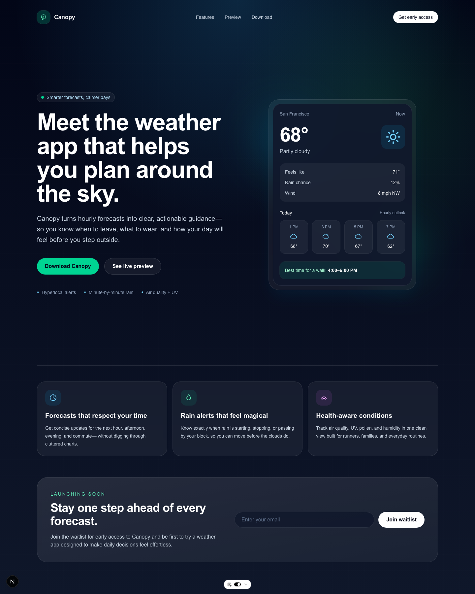
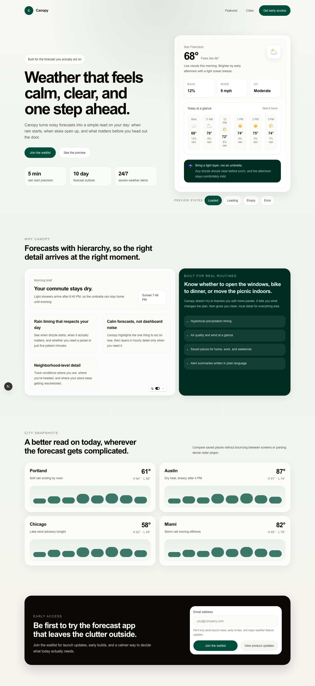

# case study — canopy

**prompt:** build a landing page for a new weather app called Canopy
**type:** landing page
**generator:** gpt-5.4
**judge:** claude-sonnet-4-6
**timestamp:** 2026-03-18T05:03:50Z
**score:** 16 → 40 (+24)

## live artifacts

| variant | route | source |
|---|---|---|
| before | `/before/canopy` | [`demos/src/app/before/canopy/page.tsx`](../../demos/src/app/before/canopy/page.tsx) |
| after | `/after/canopy` | [`demos/src/app/after/canopy/page.tsx`](../../demos/src/app/after/canopy/page.tsx) |

to render locally: `cd demos && pnpm install && pnpm dev` then open the routes above.

## screenshots

### before

### after

## rules fired

### before

**anti-pattern-check.py — 4 warnings, 2 info**

| severity | rule | count |
|---|---|---|
| info | Zinc/Slate palette | 23 |
| warning | No loading state | 1 |
| warning | No empty state | 1 |
| warning | No error state | 1 |
| warning | Placeholder text | 2 |
| info | Generic button labels | 1 |

**state-check.py — fail**

| state | present |
|---|---|
| loading | no |
| empty | no |
| error | no |

### after

**anti-pattern-check.py — 1 warning, 2 info**

| severity | rule | count |
|---|---|---|
| warning | Placeholder text | 1 |
| info | `transition-all` usage | 1 |
| info | Generic button labels | 1 |

**state-check.py — pass** (loading, empty, error all present)

## rubric

| dimension | before | after | delta |
|---|---:|---:|---:|
| hierarchy | 7 | 9 | +2 |
| spacing | 7 | 9 | +2 |
| copy | 7 | 9 | +2 |
| productFit | 7 | 8 | +1 |
| screenshotWorthy | 7 | 9 | +2 |
| **judge total** | **35** | **44** | **+9** |

## penalties

| category | before | after |
|---|---:|---:|
| anti-pattern | -10 | -4 |
| missing states | -9 | 0 |
| responsive | 0 | 0 |

## what changed

the before variant scored respectably on the judge (35/50) but lost 19 points to deterministic penalties — the loop is what moves those. three missing states meant -9 before the judge even rendered an opinion, and zinc-slate filler across 23 class uses plus two placeholder strings and two "submit"-class button labels tacked on another 10. the after variant closes almost all of that: every state is present, the palette commitment is specific instead of default, and the judge's screenshot-worthy dimension moved 7 → 9, which is the dimension most correlated with "does this look like someone made a decision."

the remaining 1 warning + 2 info on the after variant — one residual placeholder and a `transition-all` + a generic button label — would be caught by a second iteration, and are the kind of hit that should be promoted into `references/anti-patterns.md` for the next run.

## follow-ups

1. residual placeholder text in the after variant — triage: copy pass before ship
2. `transition-all` — already tracked; candidate for an explicit lint rule
3. productFit at 8 — the weather-app frame could push further on domain specificity (named cities, real forecast units, specific time ranges)
4. rubric weights from `skills/agentic-design-system/SKILL.md` not computed on this run — v1.1 report format adds it
