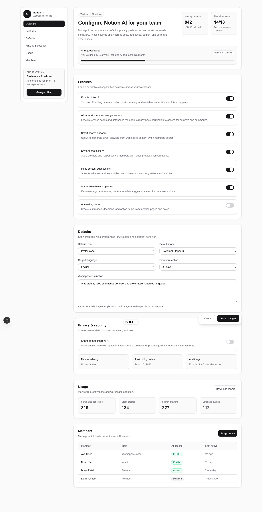
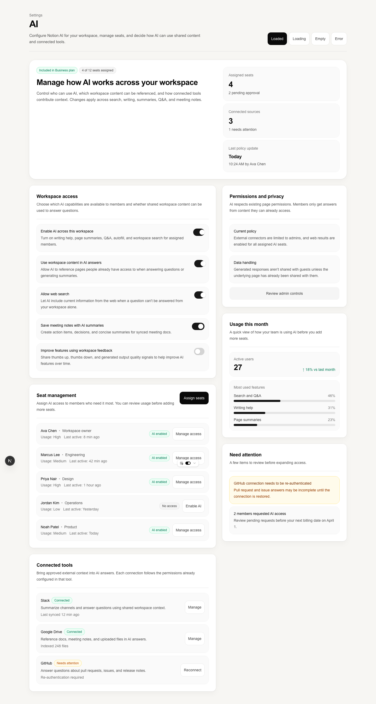

# case study — notion-ai-settings

**prompt:** build a settings page for Notion's AI features
**type:** settings
**generator:** gpt-5.4
**judge:** claude-sonnet-4-6
**timestamp:** 2026-03-18T05:07:51Z
**score:** 17 → 40 (+23)

## live artifacts

| variant | route | source |
|---|---|---|
| before | `/before/notion-ai-settings` | [`demos/src/app/before/notion-ai-settings/page.tsx`](../../demos/src/app/before/notion-ai-settings/page.tsx) |
| after | `/after/notion-ai-settings` | [`demos/src/app/after/notion-ai-settings/page.tsx`](../../demos/src/app/after/notion-ai-settings/page.tsx) |

to render locally: `cd demos && pnpm install && pnpm dev` then open the routes above.

## screenshots

### before

### after

## rules fired

### before

**anti-pattern-check.py — 4 warnings, 1 info**

| severity | rule | count |
|---|---|---|
| info | Zinc/Slate palette | 123 |
| warning | No loading state | 1 |
| warning | No empty state | 1 |
| warning | No error state | 1 |
| warning | Placeholder text | 1 |

**state-check.py — fail**

| state | present |
|---|---|
| loading | no |
| empty | no |
| error | no |

### after

**anti-pattern-check.py — 0 warnings, 0 info (clean)**

**state-check.py — pass** (loading, empty, error all present)

## rubric

| dimension | before | after | delta |
|---|---:|---:|---:|
| hierarchy | 7 | 8 | +1 |
| spacing | 7 | 8 | +1 |
| copy | 7 | 8 | +1 |
| productFit | 7 | 8 | +1 |
| screenshotWorthy | 7 | 8 | +1 |
| **judge total** | **35** | **40** | **+5** |

## penalties

| category | before | after |
|---|---:|---:|
| anti-pattern | -9 | 0 |
| missing states | -9 | 0 |
| responsive | 0 | 0 |

## what changed

settings pages are the most deterministic case in this set. the judge's dimensions all moved by exactly one point, which is what we expect when a prompt is well-trodden — settings pages have strong priors in any frontier model, so the delta comes almost entirely from the floor: states present, palette not defaulted, copy not placeholder.

the zinc-slate count in the before variant — 123 class uses — is telling. settings pages are where an untended agent will reach for neutral palettes the hardest because "it's a settings page, it should be calm." the skill pack rejects that shortcut. the after variant has zero anti-pattern hits *and* still reads as a settings page, which is the point: the system doesn't make things louder, it makes the defaults specific.

the judge plateau at 8 across all dimensions is a signal. productFit won't reach 9 for a generic "Notion AI settings" prompt without a project-identity file saying what these AI features actually do — a cold prompt gets a cold-prompt ceiling. see `presets/saas.md` and `templates/project-identity-template.md` for how to break it.

## follow-ups

1. plateau at 8 is the identity-file wall — same recommendation as pawprint
2. verify this route against a brand-constrained identity file for higher productFit
3. the prompt names a real company ("Notion") which per `routing/ROUTING.md` should trigger the context pass — this case is a clean example to verify that path fires correctly in future runs
