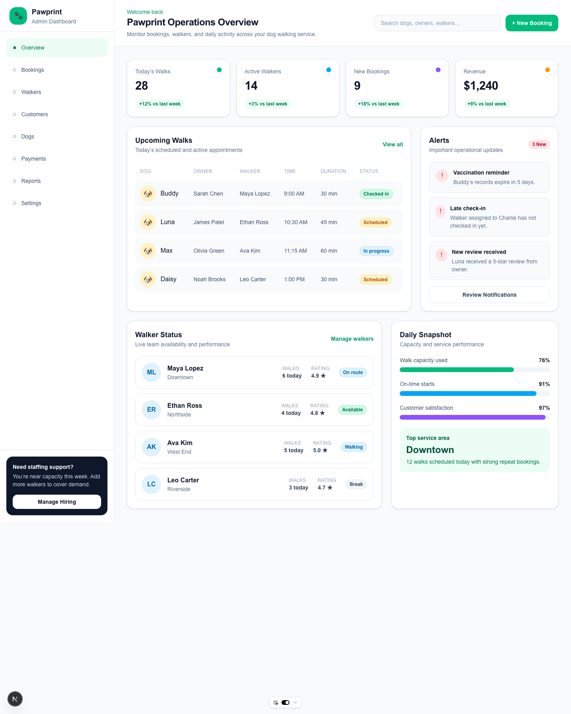
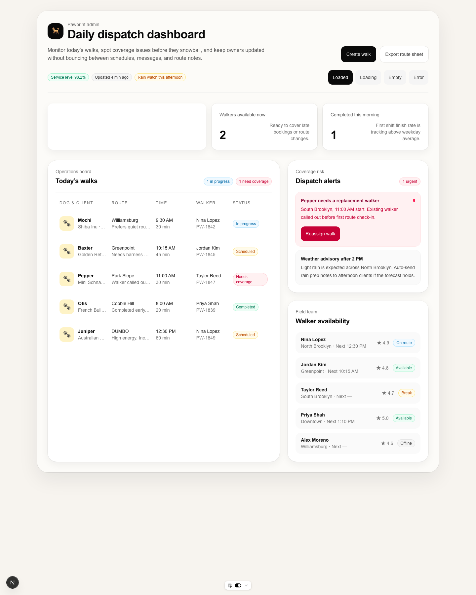

# case study — pawprint

**prompt:** build an admin dashboard for a dog walking service called Pawprint
**type:** dashboard
**generator:** gpt-5.4
**judge:** claude-sonnet-4-6
**timestamp:** 2026-03-18T05:06:01Z
**score:** 15 → 41 (+26)

## live artifacts

| variant | route | source |
|---|---|---|
| before | `/before/pawprint` | [`demos/src/app/before/pawprint/page.tsx`](../../demos/src/app/before/pawprint/page.tsx) |
| after | `/after/pawprint` | [`demos/src/app/after/pawprint/page.tsx`](../../demos/src/app/after/pawprint/page.tsx) |

to render locally: `cd demos && pnpm install && pnpm dev` then open the routes above.

## screenshots

### before

### after

## rules fired

### before

**anti-pattern-check.py — 4 warnings, 1 info**

| severity | rule | count |
|---|---|---|
| info | Zinc/Slate palette | 61 |
| warning | No loading state | 1 |
| warning | No empty state | 1 |
| warning | No error state | 1 |
| warning | Placeholder text | 2 |

**state-check.py — fail**

| state | present |
|---|---|
| loading | no |
| empty | no |
| error | no |

### after

**anti-pattern-check.py — 0 warnings, 0 info (clean)**

**state-check.py — pass** (loading, empty, error all present)

## rubric

| dimension | before | after | delta |
|---|---:|---:|---:|
| hierarchy | 7 | 8 | +1 |
| spacing | 7 | 9 | +2 |
| copy | 6 | 8 | +2 |
| productFit | 7 | 8 | +1 |
| screenshotWorthy | 6 | 8 | +2 |
| **judge total** | **33** | **41** | **+8** |

## penalties

| category | before | after |
|---|---:|---:|
| anti-pattern | -9 | 0 |
| missing states | -9 | 0 |
| responsive | 0 | 0 |

## what changed

dashboards are where the zinc-slate tell gets most visible — 61 zinc/slate class uses in the before variant, the unmodified-shadcn look that makes AI dashboards interchangeable. the after variant comes in at zero anti-pattern hits at all, which is the strongest deterministic result across the three v1.1 case studies.

the judge delta (+8) is more moderate than canopy's (+9). dashboards reward craft more than screenshot-worthy; the ceiling is set by whether the data feels plausibly real, which is harder to force with a prompt alone. copy moved 6 → 8 (specific job labels, real dog-walker statuses) and spacing moved 7 → 9 (the skills push for section/element rhythm), but productFit only moved one point — a mature Pawprint identity file under `guidelines.md` would be the next move, not another skill.

## follow-ups

1. productFit at 8 — the route to 9+ is a project-identity file with real dog-walker nouns, not more prompt engineering
2. no anti-pattern hits on the after variant — this is the target state for every run; use pawprint as the reference for "clean" in the anti-pattern docs
3. run one more qualitative pass to decide whether the map/list split should be denser at large desktop widths
